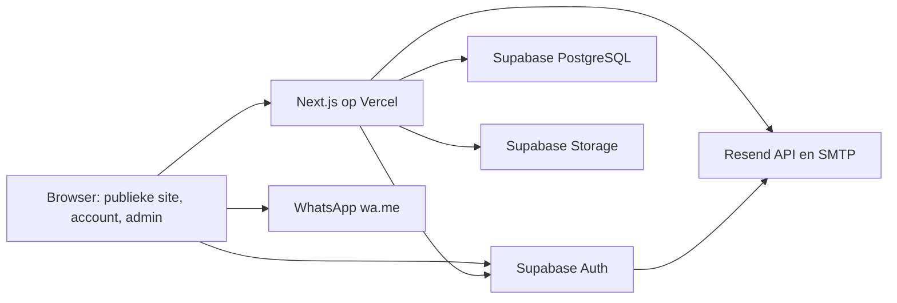
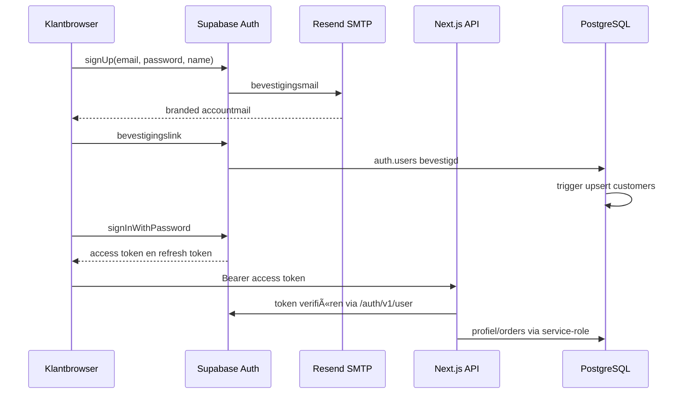
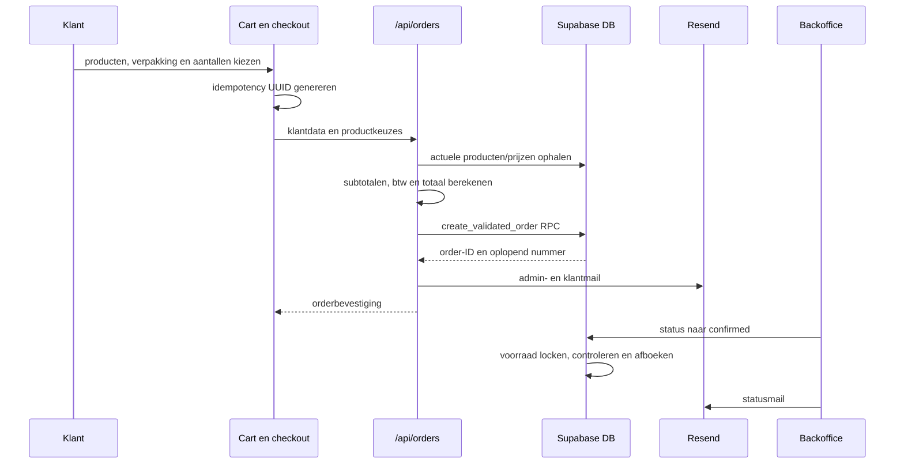

# Technisch overdrachtsrapport: Nancy's Castalla

**Documentstatus:** actuele technische situatie  
**Peildatum:** 12 juli 2026
**Productiedomein:** `https://www.nancys.es`  
**Repository:** `jimmybergsma3-collab/NANCY-S-CASTALLA`  
**Doelgroep:** ontwikkelaars, beheerders en technische partners die het project zonder voorafgaande broncodekennis moeten kunnen overnemen.

> Dit rapport beschrijft uitsluitend de aantoonbare actuele toestand van de repository. De korte operationele go-live-status staat in `../PROJECT_STATUS.md`; wijzigingsgeschiedenis staat in `CHANGELOG.md`; de motivatie achter technische beslissingen staat in `DECISIONS.md`. Instellingen die alleen in Vercel, Supabase, Resend of DNS bestaan, kunnen vanuit de broncode niet volledig worden bewezen en zijn als extern te controleren gemarkeerd. De migraties in `supabase/migrations` gelden als de gezaghebbende databasespecificatie; `supabase-schema.sql` en oudere documentatie kunnen achterlopen.

## Inhoud

1. Projectoverzicht
2. Technologie
3. Architectuur
4. Database
5. Authenticatie en autorisatie
6. Adminpanel en backoffice
7. Publieke website
8. Functionaliteitsmatrix
9. API-routes
10. E-mailsysteem
11. Bestelproces
12. Voorraadbeheer
13. Afhalen en bezorgen
14. Facturatie en betalingen
15. SEO
16. Responsive design en visuele keuzes
17. Performance
18. Security
19. Bekende problemen en technische schuld
20. Roadmap
21. Technisch advies
22. Beknopte systeemsamenvatting

---

# 1. Projectoverzicht

## 1.1 Doel

Nancy's Castalla is een meertalige webwinkel en operationele backoffice voor een kleinschalige internationale food-market in Castalla, Spanje. De eerste commerciële fase werkt met kleine voorraad, pre-orders, afhalen in Castalla, lokale bezorging wanneer mogelijk en klantcontact via WhatsApp.

Het assortiment richt zich op Nederlandse, Britse, Ierse, Duitse, Scandinavische, Aziatische/Indonesische, Zuid-Amerikaanse en overige internationale producten. Producten kunnen per stuk, per verpakking of via meerdere klantverpakkingen worden verkocht. Brood wordt hoofdzakelijk op voorbestelling aangeboden.

## 1.2 Huidige status

De applicatie is online als productie-implementatie op Vercel, maar functioneel nog in een **pre-order/MVP-fase**. De kern is aanwezig:

| Onderdeel | Status | Toelichting |
|---|---|---|
| Publieke catalogus | Werkend | Categorieën, zoeken, productkaarten en detailpagina's |
| Productbeheer | Werkend | Toevoegen, wijzigen, verwijderen, foto's uploaden en zichtbaarheid beheren |
| Klantregistratie en login | Werkend | Supabase Auth, e-mailbevestiging en wachtwoordherstel |
| Klantprofiel | Werkend | Naam, e-mail, telefoon, adres en taal; account toont uitklapbare orderdetails en eigen factuurdownload |
| Database-orders | Werkend | Server-side prijscontrole, idempotentie, orderopslag en volledige admin-detailweergave |
| WhatsApp-bestellen | Werkend | CTA en samengesteld bericht; dit is een apart kanaal naast database-orders |
| Voorraad | Werkend voor kernflow | Afboeken bij bevestiging, terugboeken bij annulering |
| E-mail | Werkend mits extern correct ingesteld | Resend voor orders, Supabase Custom SMTP voor accounts |
| Online betaling | Niet actief | Bizum en bankoverschrijving worden handmatig afgehandeld; contant, kaart en Stripe zijn niet zichtbaar/selecteerbaar voor klanten |
| Inkoop/rapportages | Gedeeltelijk | Inkoop is overzicht/voorbereiding; rapportages tonen basistellingen en betaalde omzet |
| Facturatie | Werkend na migratie | Orderfactuur, snapshots, PDF, klantdownload en Resend-verzending; nog geen creditnota of boekhoudexport |
| Sales-unit prijsveiligheid | Applicatiecode aanwezig; migratie handmatig uitvoeren | Leveranciersdoosprijs, bron-eenheidsprijs en publieke verkoopeenheid zijn gescheiden zodat importproducten niet per ongeluk met doosverpakking tegen eenheidsprijs live gaan. |

## 1.3 Productie versus development

- **Productie:** Vercel, `www.nancys.es`, Supabase als productiebackend en Resend als e-mailinfrastructuur.
- **Lokaal:** Next.js developmentserver via `npm run dev`, standaard op `http://localhost:3000`.
- **Belangrijk verschil:** lokale en Vercel-environmentvariabelen zijn onafhankelijk. Vooral adminlogin, service-role toegang, Resend en redirect-URL's moeten in beide omgevingen afzonderlijk correct staan.
- **Databaseschema:** wijzigingen worden als SQL-migraties bijgehouden, maar uitvoering in productie is een handmatige operationele stap. De repository bewijst niet dat iedere migratie daadwerkelijk in de productie-Supabase is uitgevoerd.

## 1.4 Belangrijkste openstaande onderdelen

1. Betrouwbare productiecontrole van alle Vercel-, Supabase-, Resend- en DNS-instellingen en een volledige productie-smoketest.
2. Formele order-state-machine, statushistorie en voorraadreserveringsbesluit; de huidige kerntransities werken al transactioneel.
3. Server-side handhaving van bezorgminimum, bezorgkosten en bezorggebied.
4. Volwaardige inkoop, goederenontvangst, leveranciersmutaties en uitgebreide rapportages.
5. Creditnota's, boekhoudexport en fiscale validatie; normale interne facturen en PDF's zijn al aanwezig.
6. Resterende productinhoud, backoffice en compliance professioneel vertalen en controleren.
7. Product- en categorie-SEO, structured data en volledige sitemap.
8. Rate limiting, individuele admins/MFA, geautomatiseerde tests, CI, monitoring, auditlogging en operationele runbooks.
9. Handmatig uitvoeren van `supabase/migrations/202607120002_sales_unit_price_basis_safety.sql` in Supabase productie voor database-level blokkade op ongecontroleerde sales-unit/prijsbasis.

---

# 2. Technologie

## 2.1 Stack en versies

| Technologie | Versie/status | Functie |
|---|---:|---|
| Next.js | 16.2.9 | App Router, server rendering, routes en API-handlers |
| React | 19.0.0 | Componenten en clientinteractie |
| React DOM | 19.0.0 | Browser-rendering |
| TypeScript | 5.7.2 | Statische typen voor product-, order- en backofficemodellen |
| Tailwind CSS | 3.4.17 | Styling en responsive utilities |
| PostCSS | 8.4.49 | CSS-transformatie |
| Autoprefixer | 10.4.20 | Browserprefixes |
| Supabase JS | `^2.50.0` | Klantauthenticatie en browsersessies |
| Supabase REST/RPC | Externe dienst | Database, opslag, auth en server-side RPC's |
| Vercel | Externe dienst | Hosting, serverless runtime, domein en environmentvariabelen |
| Resend | Externe dienst | Transactionele ordermail en SMTP voor Supabase Auth |
| Lucide React | 0.468.0 | Interface-iconen |
| pdf-parse | ^2.4.5 | Server-side tekstextractie voor Europ Foods PDF-importpreview |
| xlsx | ^0.18.5 | Server-side XLS/XLSX parsing voor Tindale-importpreview |
| ESLint | 9.17.0 | Statische codecontrole |
| Stripe | Niet geinstalleerd | Alleen providerarchitectuur voorbereid; geen checkout of sleutelgebruik |

De scripts gebruiken bewust Webpack:

```text
npm run dev    -> next dev --webpack
npm run build  -> next build --webpack
npm run start  -> next start
npm run lint   -> eslint . --max-warnings=0
```

Webpack is gekozen nadat Turbopack tijdens ontwikkeling instabiele chunk- en workerfouten gaf. Dit vermindert ontwikkelproblemen zonder de functionele architectuur te veranderen.

Databasewijzigingen staan in `supabase/migrations` en moeten bewust in Supabase productie worden uitgevoerd. Let extra op bij leveranciersimports: leveranciersprijzen zijn geen publieke verkoopprijzen. Vanaf migratie `202607120002_sales_unit_price_basis_safety.sql` bewaart `products` aparte velden voor leverancierdoosprijs, bron-eenheidsprijs, aantal per doos, bronverpakking, publieke verkoopeenheid, sales-unit quantity en twee adminreviewvinkjes. De applicatiecode blokkeert geïmporteerde producten uit `IMPORT_2026_LIVE_%` in publieke queries, cartvalidatie en adminpublicatie wanneer deze prijsbasis niet gecontroleerd is.

## 2.2 Motivatie

- **Next.js App Router:** combineert publieke pagina's, dynamische metadata, servercomponenten en server-side API's in één deploybaar project.
- **TypeScript:** verlaagt het risico bij een rijk productmodel met prijzen, btw, verpakkingen, categorieën en voorraad.
- **Tailwind:** ondersteunt snelle, consistente responsive styling zonder een zware componentenbibliotheek.
- **Supabase:** levert PostgreSQL, Auth, Storage en RPC's met weinig operationeel beheer. Het project kan daardoor klein starten en later uitbreiden.
- **Vercel:** sluit direct aan op Next.js en GitHub-deployments.
- **Resend:** verzorgt zowel API-mail voor orders als SMTP voor Supabase-accountmails met eigen domeinafzenders.
- **Geen Stripe in V1:** de onderneming werkt eerst met Bizum en overschrijving. De betaalproviderlaag voorkomt een toekomstige herbouw.

## 2.3 Ontbrekende engineeringtools

Er is geen testframework, componentcatalogus, foutmonitoring, analyticsplatform, jobqueue, CI-workflow of database-ORM aanwezig. Database-interactie gebeurt via Supabase REST en PostgreSQL-RPC's.

---

# 3. Architectuur

## 3.1 Architectuurbeeld



De publieke frontend en serverbackend staan in dezelfde Next.js-repository, maar bedrijfslogica is zo veel mogelijk verdeeld over `services`, `lib` en API-routes. Externe integraties worden via een register en providerinterfaces voorbereid.

## 3.2 Hoofdstructuur

```text
/
|-- config/
|   `-- business.ts
|-- public/
|   |-- nancys-castalla-logo.jpg
|   |-- favicon.ico, favicon-16x16.png, favicon-32x32.png
|   `-- apple-touch-icon.png, icon-192.png, icon-512.png, site.webmanifest
|-- src/
|   |-- app/
|   |   |-- [locale]/
|   |   |   |-- account, admin, login, register, forgot-password
|   |   |   |-- products, bread, collection-delivery
|   |   |   `-- about, contact, privacy, terms
|   |   |-- api/
|   |   |   |-- account/
|   |   |   |-- admin/
|   |   |   |-- auth/
|   |   |   `-- orders/
|   |   |-- redirects voor routes zonder taalprefix
|   |   |-- layout.tsx, globals.css, robots.ts, sitemap.ts
|   |-- components/
|   |   |-- admin/
|   |   |-- auth/
|   |   `-- publieke componenten
|   |-- data/
|   |   `-- products.ts
|   |-- i18n/
|   |   `-- config.ts
|   |-- lib/
|   |-- payments/
|   |-- services/
|   |   |-- integrations/
|   |   |-- inventory/
|   |   |-- imports/
|   |   `-- orders/
|   `-- types/
|-- supabase/
|   |-- imports/
|   |-- migrations/
|   `-- templates/
|-- src/proxy.ts
|-- next.config.ts
|-- tailwind.config.ts
`-- package.json
```

## 3.3 Verantwoordelijkheden per map

| Map/bestand | Verantwoordelijkheid |
|---|---|
| `config/business.ts` | Centrale bedrijfsgegevens: naam, adres, WhatsApp, e-mails, bezorgregels, Bizum, banktekst, faseberichten, business mode en factuurseries |
| `public` | Statische merkassets, in het bijzonder het Nancy's Castalla-logo |
| `src/app/[locale]` | Alle meertalige pagina's met taalprefix `en`, `nl`, `de`, `es` of `sv` |
| `src/app/api` | Server-side HTTP-endpoints voor orders, accounts en beheer |
| `src/components` | Herbruikbare UI, productbestelling, header, footer, delen en prijsweergave |
| `src/components/admin` | Adminlogin, shell, orders en voorraadpanelen |
| `src/components/auth` | Login, wachtwoordherstel en accountdashboard |
| `src/data/products.ts` | Lokale fallback/startdata; niet de primaire productiecatalogus |
| `src/i18n` | Ondersteunde locales en tekstwoordenboeken |
| `src/lib` | Authhelpers, e-mail, environmentvalidatie, prijslogica, productmapping, Supabaseclients en WhatsApp |
| `src/payments` | Providercontracten en voorbereidende betaalstructuur; geen actieve Stripe-provider |
| `src/services/orders` | Server-authoritatieve ordervalidatie en berekening |
| `src/services/inventory` | Voorraadmutaties en adminvoorraaddiensten |
| `src/services/integrations` | Register van toekomstige externe koppelingen |
| `src/types` | Centrale TypeScriptmodellen voor producten en backoffice |
| `supabase/migrations` | Chronologische, gezaghebbende SQL-schemawijzigingen |
| `supabase/imports` | Grote leveranciersimports, standaard verborgen voor de publieke winkel |
| `supabase/templates` | Branded HTML voor bevestiging en wachtwoordherstel via Supabase Auth |
| `src/proxy.ts` | Next.js 16 taalroutering voor routes zonder locale op basis van cookie, browsertaal, optionele landcode en Engelse fallback |

## 3.4 Belangrijke ontwerpgrenzen

- Publieke productdata wordt server-side uit Supabase geladen.
- Klantauth werkt rechtstreeks met Supabase Auth in de browser; beveiligde account-API's verifiëren vervolgens het bearer-token server-side.
- Adminauth is bewust apart en gebruikt geen Supabase-gebruiker, maar een server-side gedeeld credential uit Vercel-environmentvariabelen.
- De browser is nooit de bron van waarheid voor orderprijzen, btw of voorraad.
- Productinhoud kan uit de database komen en bij een fout terugvallen op lokale data. Dit verhoogt beschikbaarheid, maar kan databaseproblemen maskeren.

---

# 4. Database

## 4.1 Algemeen

De database is PostgreSQL via Supabase. UUID's worden gegenereerd met `gen_random_uuid()`. Tabellen hebben Row Level Security ingeschakeld. De migraties bevatten geen publieke SELECT/INSERT-policies voor de bedrijfsdata. Daardoor is directe toegang door `anon` en gewone `authenticated` rollen standaard geblokkeerd; de Next.js-server gebruikt de service-role, die RLS mag omzeilen.

**Belangrijk:** RLS inschakelen zonder policies is in deze architectuur een bewuste default-deny. Klanttoegang loopt via gecontroleerde API-routes, niet rechtstreeks naar tabellen.

## 4.2 `products`

**Doel:** centrale catalogus, prijsadministratie, voorraad en productinhoud.

Belangrijkste kolommen:

| Groep | Kolommen |
|---|---|
| Identiteit | `id` tekstuele code, `uuid`, `sku`, optioneel `ean` |
| Presentatie | `name`, `description`, `image_url`, `images`, `is_visible`, `featured`, `is_new` |
| Indeling | `category`, `categories`, `origin`, `type`, `stock_status` |
| Lifecycle/import | `product_status`, `import_batch`, `archived_at` |
| Verkoop | `sale_price_incl_vat`, `unit`, `package_options`, `weight` |
| Inkoop | `cost_price_ex_vat`, `vat_rate`, `supplier`, `supplier_code`, `pack_size`, `unit_cost` |
| Marge | `margin_percent`, `profit_per_unit` |
| Voorraad | `stock_quantity`, `minimum_stock`, `track_inventory` |
| Detailinformatie | `ingredients`, `directions`, `conservation`, `additional_info` |
| Audit | `created_at`, `updated_at` waar door migraties toegevoegd |

Constraints en indexes:

- `id` is de primaire sleutel en volgt in de beheerinterface het formaat `NC-00001`.
- `uuid` heeft een unieke index.
- `sku` is uniek.
- `ean` heeft een partiele index wanneer een waarde aanwezig is, maar is niet uniek.
- `supplier_code` is niet uniek; vanaf vervolg-migratie `202607110003_product_catalogue_conflict_protection.sql` is er wel een lookup-index op leverancier plus leveranciercode.
- Er is een index voor lage voorraad/tracked inventory.
- Lifecycle-, importbatch-, categorie-, zichtbaarheid- en zoekvelden missen deels nog gerichte productie-indexen voor een zeer grote catalogus; `product_status/is_visible` en `import_batch` zijn vanaf migratie `202607110002_product_catalogue_archiving.sql` wel geindexeerd.

Relaties:

- `order_items.product_id` bewaart de productcode, maar is historisch niet als harde foreign key aangelegd.
- `inventory_movements.product_id` verwijst wel naar `products` en wordt bij verwijderen op `NULL` gezet.

RLS: ingeschakeld, geen expliciete tabelpolicies in de repository.

Vanaf migratie `202607110002_product_catalogue_archiving.sql` heeft elk product een lifecycle-status: `active`, `archived`, `disabled` of `draft`. Alleen `active` plus `is_visible=true` mag publiek worden getoond of besteld. `archived` producten blijven inclusief productcode, afbeeldingen, categorieën, voorraadvelden en relaties in de database staan. `import_batch` bewaart de herkomstbatch, zoals `IMPORT_2026_PRELAUNCH` voor de oude prijslijstcatalogus en later bijvoorbeeld `IMPORT_2026_LIVE_JULY`.

Importveiligheid: `products.id` is de unieke Nancy-productcode en de publieke URL-sleutel. `sku` is eveneens uniek en wordt standaard gelijk aan `id` gezet. `supplier_code` en `ean` zijn bewust niet uniek; ze signaleren mogelijke dubbelen, maar mogen nooit stilzwijgend een archived record overschrijven. Vervolg-migratie `202607110003_product_catalogue_conflict_protection.sql` bevat daarom een trigger die gewone updates op `product_status='archived'` blokkeert. Alleen `restore_archived_product` zet tijdelijk de interne allow-flag. Mogelijke importconflicten kunnen worden vastgelegd in `product_import_conflicts` met een handmatige keuze: nieuw importeren, overslaan, of bewust herstellen/koppelen.

Europ Foods-specifiek: de stabiele bronidentiteit is leverancier + genormaliseerde supplier code + genormaliseerde productnaam + genormaliseerde verpakking + doosprijs + eenheidsprijs. Een exact herhaalde bronvermelding in een andere PDF-sectie wordt `repeated_source_listing` en mag niet tot een tweede Nancy-product leiden. Dezelfde productnaam met een andere supplier code of verpakking is een geldige variant en mag als apart draftproduct bestaan. Dezelfde supplier code met een andere naam, verpakking of prijs blijft een echt conflict voor handmatige review. Archived producten worden nooit automatisch hersteld of gewijzigd en blokkeren een nieuwe draftvariant niet alleen op basis van naam/verpakking.

## 4.3 `customers`

**Doel:** bedrijfsprofiel van een klant, los van de technische Auth-identiteit.

Kolommen: `id` UUID primary key, `auth_user_id`, `name`, `email`, `phone`, `address`, `language`, `created_at`, `updated_at`.

Relaties en constraints:

- `auth_user_id` is uniek en verwijst naar `auth.users(id)` met `ON DELETE SET NULL`.
- `email` is uniek.
- Orders kunnen via `customer_id` naar deze tabel verwijzen.
- Een trigger op `auth.users` maakt of actualiseert automatisch het bijbehorende klantrecord.

RLS: ingeschakeld, geen directe self-service policies; toegang verloopt via de account-API.

## 4.4 `orders`

**Doel:** orderkop, klantgegevens, totalen, status, betaling en verzendmethode.

Belangrijkste kolommen:

- Identiteit: `id`, `uuid`, oplopend `order_number`, `idempotency_key`.
- Klant: `customer_id`, `customer_name`, `customer_email`, `customer_phone`.
- Fulfilment: `fulfillment`, `delivery_method`, `notes`.
- Financieel: `subtotal_ex_vat`, `vat_total`, `total`, `payment_status`.
- Betaalvoorkeur: nieuwe klantorders tonen alleen `bizum` en `bank-transfer`; historische waarden `cash`, `card` en `pending` blijven leesbaar als labels.
- Proces: `status`, `inventory_committed`.
- E-mailtracking: tijdstempels voor admin-, klant- en statusmail.
- Audit: `created_at`, `updated_at`.

Constraints/indexes:

- `id` is primary key.
- `uuid` is uniek.
- `order_number` is een oplopende identity en uniek.
- `idempotency_key` heeft een partiele unieke index.
- Index op status en creatiedatum.
- `customer_id` verwijst naar `customers`; deze foreign key is historisch als `NOT VALID` toegevoegd en moet in productie expliciet worden gevalideerd.
- Statuswaarden zijn niet als database-`CHECK` of enum afgedwongen. RPC/API-validatie bewaakt de toegestane waarden.

RLS: ingeschakeld; server-side service-role toegang.

## 4.5 `order_items`

**Doel:** onveranderlijke orderregels met een snapshot van productnaam, verpakking en prijs.

Kolommen: identity `id`, `order_id`, `product_id`, `product_name`, `quantity`, `unit`, `package_label`, `package_quantity`, `unit_price`, `vat_rate`, `line_total_ex_vat`, `line_total_incl_vat`.

- `order_id` verwijst naar `orders` met cascade delete.
- Productnaam en prijs worden gekopieerd, zodat oude orders leesbaar blijven wanneer een product later wijzigt.
- `product_id` is geen gegarandeerde foreign key; dit voorkomt dat catalogusopschoning historische orders blokkeert, maar vermindert referentiele controle.

RLS: ingeschakeld.

## 4.6 `suppliers`

**Doel:** leveranciersstamgegevens.

Kolommen: UUID `id`, unieke `code`, unieke `name`, contact- en adresvelden, `active`, JSON `metadata`, timestamps.

De tabel is initieel gevuld met unieke leveranciersnamen uit producten. Producten bevatten daarnaast nog steeds een tekstveld `supplier`; er is dus nog geen volledige foreign-keynormalisatie.

RLS: ingeschakeld.

## 4.7 `inventory_movements`

**Doel:** audittrail van voorraadwijzigingen.

Kolommen: UUID `id`, `product_id`, `order_id`, `movement_type`, `quantity`, `reference`, `notes`, `created_at`.

- Foreign keys naar product en order gebruiken `ON DELETE SET NULL`.
- Index op product en datum.
- Positieve en negatieve aantallen vertegenwoordigen toevoegingen en afboekingen.
- Er is geen databaseconstraint die toegestane movement types afdwingt.

RLS: ingeschakeld.

## 4.8 `purchase_orders`

**Doel:** voorbereiding voor inkooporders.

Kolommen: UUID, oplopend uniek inkoopnummer, leverancier, status, bedragen excl. btw/btw/incl. btw, verwachte en ontvangen datum, notities en timestamps.

Relatie: optionele foreign key naar `suppliers`, `ON DELETE SET NULL`.

Beperking: er is nog geen `purchase_order_items`-tabel. Daardoor is ontvangst per artikel en automatische voorraadverhoging nog niet als volledige workflow te implementeren.

RLS: ingeschakeld.

## 4.9 `invoices`

**Doel:** onveranderlijke verkoopfactuurkop gekoppeld aan een order en klant.

Kolommen omvatten UUID, oplopend uniek factuurnummer, order/ordernummer, klant, klant-/adres-/taalsnapshot, optioneel klant-NIF/CIF/NIE, bedrijfsnaam en fiscaal adres, status, betaalmethode, totalen excl. btw/btw/incl. btw, uitgiftedatum, e-mailtijdstip en timestamps. Een partiele unieke index op `order_id` staat maximaal één normale factuur per order toe.

## 4.10 `invoice_items`

**Doel:** onveranderlijke factuurregels los van latere product- of orderwijzigingen.

Iedere regel bewaart productcode, naam, verpakking, aantal, prijs incl. btw, btw-tarief, grondslag, btw-bedrag en regeltotaal. De foreign key naar `invoices` gebruikt cascade delete. RLS staat aan; toegang loopt via server-side service-role en beveiligde API's.

Relaties: optionele foreign keys naar `orders` en `customers`, beide `ON DELETE SET NULL`. Historische facturen zonder serie blijven zichtbaar via de legacy-weergave `NC-{jaar}-{invoice_number}`. Nieuwe facturen gebruiken vanaf migratie `202607110001_admin_cleanup_and_invoice_series.sql` expliciete serievelden: `invoice_series`, `invoice_series_year` en `invoice_series_number`. De prelaunch/testserie is `TEST-{jaar}-{zes cijfers}`; de productieserie is `NC-{jaar}-{zes cijfers}`. Bestaande facturen worden niet automatisch hernummerd en nummers worden niet hergebruikt.

RLS: ingeschakeld.

## 4.11 `integration_settings`

**Doel:** voorbereidende configuratie voor externe diensten.

Kolommen: UUID, unieke providernaam, `enabled`, JSON `settings`, `updated_at`.

Geheimen horen niet in het JSON-veld maar in environmentvariabelen of een secrets manager. De tabel is bedoeld voor niet-geheime providerinstellingen.

RLS: ingeschakeld.

## 4.12 `product_import_runs`

**Doel:** importgeschiedenis en rapportage per leveranciersbestand.

Deze tabel wordt toegevoegd door de nieuwe, nog handmatig uit te voeren migratie `202607120001_supplier_import_workflow.sql`. Velden omvatten leverancier, bronbestand, importbatch, bestandstype, status, dry-run vlag, start/eindtijden, aantallen voor bronregels/geparseerde producten/aangemaakte producten/updated offers/skips/conflicten/waarschuwingen/fouten en `report_json`.

Statuswaarden zijn `pending`, `analysing`, `preview_ready`, `importing`, `completed`, `failed` en `rolled_back`. RLS staat aan. Dry-runs in de API schrijven niets naar producten of supplier offers. Confirmed imports schrijven een import run en maken uitsluitend draftproducten plus supplier offers aan.

## 4.13 `supplier_product_offers`

**Doel:** meerdere leveranciersaanbiedingen per Nancy-product bewaren zonder het publieke productrecord te overschrijven.

Belangrijke velden: `product_id`, `supplier_id`, `supplier_code`, `supplier_product_name`, `ean`, `brand`, `category_source`, `storage_type`, `package_description`, `units_per_case`, `unit_weight_or_volume`, `case_price`, `unit_price`, `price_ex_vat`, `currency`, bronbestand, bronregel, source batch, prijsdatum, actief-vlag, reviewvelden en JSON metadata.

Er is geen globale unieke constraint op `supplier_code`. Een partiele unieke index is beperkt tot leverancier, bronbatch en verpakking wanneer `active=true`, zodat dezelfde leveranciercode in oude en nieuwe contexten als mogelijk conflict kan worden behandeld zonder archived producten te overschrijven. RLS staat aan.

## 4.14 `product_import_conflicts`

**Doel:** mogelijke importmatches en conflicten vastleggen voor handmatige beslissing.

Migratie `202607110003_product_catalogue_conflict_protection.sql` introduceert deze tabel; migratie `202607120001_supplier_import_workflow.sql` breidt haar uit met koppeling naar import run, bronnaam, bronverpakking, matching product, reden, beschikbare keuzes en resolver. Mogelijke resoluties zijn onder meer `import_as_new`, `skip`, `link_supplier_offer` en `restore_archived_product`. Archived producten mogen nooit automatisch worden hersteld of gewijzigd.

De admin-importmodule heeft daarnaast een recovery-flow voor bestaande Europ Foods-conflicten:

- `POST /api/admin/imports/{runId}/reclassify` leest bestaande pending conflictregels, parseert de opgeslagen bronregel opnieuw en classificeert ze als importeerbare variant, exacte herhaling, echt conflict of parse-fout.
- `POST /api/admin/imports/{runId}/import-selected-conflicts` maakt geselecteerde importeerbare varianten alsnog aan als nieuwe draftproducten met nieuwe `NC-xxxxx`-codes, `is_visible=false`, `featured=false`, `stock_quantity=0`, alle reviewflags open en zonder verkoopprijs op inkoopprijs te zetten.
- De flow maakt `supplier_product_offers` aan, markeert de opgeloste conflictregel als `import_as_new`, logt een admin-auditactie en past de import-run tellingen aan.
- Er zijn geen voorraadmutaties, geen automatische publicatie en geen mutaties op archived producten.

## 4.15 Functies en triggers

| Functie/trigger | Doel |
|---|---|
| Auth-customer trigger | Maakt of actualiseert `customers` na insert/update van een Supabase Auth-user |
| `create_validated_order` | Maakt idempotent een server-gevalideerde order en orderregels |
| `transition_order_status` | Wijzigt status/betaalstatus atomair en verwerkt voorraad bij bevestiging of annulering |
| `next_invoice_series_number` | Geeft atomair het volgende nummer binnen een factuurserie en jaar |
| `safe_delete_test_order` | Verwijdert uitsluitend expliciete testorders zonder voorraadmutatie en zonder officiele livefactuur |
| `archive_current_catalogue` | Archiveert de actieve prelaunch-catalogus onder een importbatch zonder producten te verwijderen |
| `restore_archived_product` | Herstelt één archived product naar active en zichtbaar |
| `reserve_nancy_product_codes` | Reserveert transactioneel nieuwe `NC-xxxxx`-codes op basis van de hoogste bestaande productcode |
| `publish_approved_import_batch` | Publiceert alleen draftproducten uit een batch wanneer alle reviewvelden schoon zijn en basisdata compleet is |
| `rollback_import_batch_to_draft` | Zet batchproducten veilig terug naar draft/archive en deactiveert supplier offers zonder harde delete |
| `create_order_with_inventory` | Oudere functie; niet meer de primaire applicatieroute en kandidaat voor deprecatie |

`transition_order_status` gebruikt row locks op order en producten. Daardoor kunnen twee bevestigingen niet tegelijk dezelfde voorraad overschrijven.

## 4.16 Toekomstige database-uitbreidingen

- `addresses` als aparte tabel met meerdere klantadressen.
- `order_status_history` en `payment_status_history`.
- `email_events`/transactional outbox in plaats van enkele timestamps.
- `purchase_order_items`, ontvangstregels en batch/lotbeheer.
- Creditnota's en formele annulering/correctie van facturen.
- Productvertalingen per locale.
- Productvarianten en genormaliseerde verpakkingsopties.
- Gerichte zoekindexen, eventueel PostgreSQL full-text search.
- Database-`CHECK` constraints voor status, btw, prijzen en voorraad.
- Gevalideerde foreign keys en expliciete RLS-policies waar directe Supabase-toegang gewenst is.

---

# 5. Authenticatie en autorisatie

## 5.1 Klantauthenticatie

Klantaccounts gebruiken Supabase Auth met e-mail en wachtwoord.



Registratie gebruikt momenteel de Supabase JS-client rechtstreeks in de browser. `emailRedirectTo` wijst naar `/{locale}/login?confirmed=1` op de actuele origin. Naam en actuele locale worden als Auth-metadata meegestuurd; de customer-trigger neemt de geldige taalcode over voor nieuwe klanten. De oude `/api/auth/register` bestaat nog als alternatieve/legacy route en verdient consolidatie.

## 5.2 Klantsessies

- Supabase bewaart de sessie standaard in browserstorage en vernieuwt tokens automatisch.
- De sessie is geen HttpOnly-cookie van Next.js.
- Accountcomponenten controleren client-side of een sessie bestaat en sturen anders naar login.
- De profieltaal is voor ingelogde klanten leidend. Een client-side synchronisatie leest `customers.language` en vervangt een afwijkende niet-admin-localeroute door de voorkeurslocale.
- Taalkeuze wordt tegelijk opgeslagen in `customers.language`, cookie `nancys_locale` en localStorage onder dezelfde sleutel.
- Adminroutes zijn uitgesloten van profielgestuurde localeredirects.
- Beveiligde API-routes vertrouwen niet alleen op de UI, maar verifiëren het bearer-token bij Supabase.
- Uitloggen roept `supabase.auth.signOut()` aan.
- Wachtwoordherstel gebruikt Supabase `resetPasswordForEmail`; een herstelsessie kan op de accountpagina een nieuw wachtwoord instellen.

## 5.3 Koppeling aan `customers`

Een database-trigger koppelt `auth.users.id` aan `customers.auth_user_id`. Bestaande Auth-users worden door de migratie teruggevuld. Het profiel bevat naam, e-mail, telefoon, adres en taal. Een ingelogde klant wordt in het bestelcomponent herkend; deze velden worden vooraf ingevuld.

## 5.4 Adminauthenticatie

Adminauth is een eenvoudige, afzonderlijke server-side login:

1. E-mail en wachtwoord worden gelezen uit `ADMIN_EMAIL` en `ADMIN_PASSWORD`.
2. E-mail wordt getrimd en lowercase vergeleken.
3. Het wachtwoord wordt met timing-safe vergelijking gecontroleerd.
4. Na succes zet de server de cookie `nancys_admin`.
5. De cookie is HttpOnly, `SameSite=Lax`, in productie `Secure`, pad `/` en maximaal zeven dagen geldig.
6. De cookiewaarde is een HMAC/SHA-256-afgeleide token, gekoppeld aan het ingestelde wachtwoord. Een gewijzigd adminwachtwoord maakt bestaande cookies ongeldig.

Adminpagina's gebruiken `requireAdmin`; admin-API's gebruiken `isAdminSession`. De adminlink hoort niet in het publieke menu te staan. De loginroute is `/{locale}/admin/login`, met `/admin/login` als taalredirect.

## 5.5 Autorisatiemodel

- Klant: toegang tot eigen profiel en eigen orderhistorie via geverifieerd Auth-token.
- Admin: volledige backoffice via één gedeeld credential.
- Publiek: alleen zichtbare producten en openbare content.
- Service-role: uitsluitend server-side voor databasehandelingen.

Er zijn nog geen adminrollen, individuele medewerkers, MFA, permissions, sessieoverzicht of auditlog. Dit gedeelde adminmodel is acceptabel voor een zeer kleine start, maar niet voor een groeiend team.

---

# 6. Adminpanel en backoffice

## 6.1 Routes en navigatie

- Login: `/{locale}/admin/login`
- Dashboard: `/{locale}/admin`
- Productbeheer: `/{locale}/admin/products`
- Prijshelper: `/{locale}/admin/pricing`
- Modules: `/{locale}/admin/{module}`

De `AdminShell` biedt modules voor Dashboard, Producten, Categorieën, Klanten, Orders, Voorraad, Leveranciers, Supplier imports, Inkoop, Facturatie, BTW, Rapportages, Instellingen en API-integraties.

## 6.2 Productbeheer

Aanwezige functies:

- Automatisch volgend productnummer in formaat `NC-00001`.
- Product toevoegen, selecteren, wijzigen en veilig archiveren. De admin delete-actie voert geen fysieke database-delete meer uit.
- Zoeken, filteren, statusoverzicht en paginering voor grote catalogi.
- Standaardfilter op actieve producten, plus filters voor `active`, `archived`, `disabled`, `draft` en `all`.
- Meerdere categorieën per product.
- SKU/leverancierscode, EAN, leverancier en herkomst.
- Kostprijs excl. btw, btw-percentage, eenheidskosten en verkoopprijs incl. btw.
- Leveranciersverpakking en klantverpakkingen op meerdere regels.
- Voorraad, minimumvoorraad en voorraadtracking.
- `available`, `preorder` en `coming-soon`.
- Lifecycle-status `active`, `archived`, `disabled`, `draft`; alleen active kan publiek zichtbaar zijn.
- Importbatchtracking, met bulkarchivering van de oude catalogus onder `IMPORT_2026_PRELAUNCH`.
- Actief/verborgen, featured en nieuw.
- Afbeeldings-URL of bestand uploaden naar Supabase Storage.
- Ingrediënten, gebruiksaanwijzing, bewaring en extra informatie.

De prijshelper kan btw, winst en marge tonen. De oude automatische 50%-regel is geen verplichte verkoopprijs meer; de beheerder bepaalt de verkoopprijs.

De bulkactie `Archive current catalogue` zet de huidige catalogus op `archived`, maakt producten onzichtbaar, schakelt featured uit en bewaart de batchnaam. Dit verwijdert geen producten, afbeeldingen, categorieën, productcodes, relaties of voorraadhistorie. Individuele archived producten kunnen via `restore_archived_product` worden hersteld.

## 6.3 Orders

Het orderpaneel toont een aanklikbare, responsieve orderlijst. De detailweergave bevat het gekoppelde klantprofiel, datum en fulfilment, notities, alle `order_items`, prijzen en btw-totalen. De beheerder kan status en betaalstatus wijzigen of de klant direct bellen, via WhatsApp benaderen of e-mailen. Orders zonder regels krijgen een expliciete waarschuwing.

Ordernotities zijn in het detailpaneel bewerkbaar en worden via een afzonderlijke adminactie opgeslagen met een limiet van 5000 tekens. Dit voorkomt dat een notitiewijziging onbedoeld een status- of voorraadtransitie start.

De orderservice haalt orderregels genest op en verrijkt de resultaten in een gebundelde tweede query met de profielen uit `customers`. Omdat oudere orders nog geen afzonderlijk adressnapshot hebben, gebruikt de weergave eerst het klantprofiel en kan zij daarnaast een gelokaliseerde `Address`/`Adres`/`Adresse`/`Dirección`/`Adress`-regel uit de ordernotitie herkennen. Het orderpaneel is compact gemaakt met zoeken op ordernummer/klant/e-mail, filters voor status, betaalstatus, datum en real/test/archived, bulkselectie voor testorders, archiveren, testmarkering en een streng geblokkeerde deleteactie voor testorders.

De admin-API voor orders retourneert altijd JSON met `success`, `data` en `diagnosticId` of een JSON-foutvorm. Wanneer productie nog cleanup-/factuurserievelden uit `202607110001_admin_cleanup_and_invoice_series.sql` mist, valt de orderservice terug op een basisselectie zonder die kolommen en vult zij veilige standaardwaarden in. Leesacties blijven dan bruikbaar; test-/archiefacties die die kolommen nodig hebben geven een duidelijke beheerfout terug en wijzigen geen data.

Belangrijke statussen zijn:

- `new`
- `confirmed`
- `processing`
- `ready`
- `shipped`
- `delivered`
- `cancelled`

Bij bevestiging wordt tracked voorraad atomair afgeboekt. Bij annulering wordt eerder afgeboekte voorraad teruggezet. Fouten, zoals onvoldoende voorraad, worden aan de beheerinterface teruggegeven.

Beperking: niet alle overgangspaden zijn formeel afgedwongen. Bijvoorbeeld direct van `new` naar `delivered` kan technisch mogelijk zijn als de API-validatie dat niet blokkeert. Een expliciete state machine is aanbevolen.

## 6.4 Voorraad

- Overzicht van producten met voorraadtracking.
- Lage voorraad op basis van `minimum_stock`.
- Handmatige correcties met voorraadbeweging.
- Ordergerelateerde bewegingen.

Een handmatige correctie bestaat uit een productupdate en een movementregistratie. Als deze niet in één database-RPC/transactie gebeurt, bestaat een klein risico op afwijking bij een gedeeltelijke fout.

## 6.5 Klanten

Het klantenscherm toont klantgegevens uit `customers` met detailpaneel, zoekfunctie en filters voor actief, gearchiveerd, test/diagnostic, zonder account en met account. Beheer kan klanten archiveren/herstellen en als test markeren. Definitief verwijderen is server-side geblokkeerd wanneer `auth_user_id`, orders of facturen bestaan; in die gevallen is archiveren de veilige actie. Alleen records zonder account, orders en facturen kunnen na exacte naam/e-mailbevestiging worden verwijderd. Volwaardige profielbewerking, segmentatie, GDPR-export, adresbeheer en klantnotities ontbreken nog.

De admin-API voor klanten gebruikt dezelfde veilige JSON-vorm als Orders. Als productie nog geen `archived_at`, `is_test` of `test_reason` op `customers` heeft, laadt de lijst met basisvelden en standaardwaarden. Archiveren of testmarkeren meldt dan expliciet dat de cleanup-migratie nodig is en voert geen gedeeltelijke update uit.

## 6.6 Leveranciers en inkoop

Leveranciers worden uit de database getoond. Inkooporders hebben een voorbereid datamodel en overzicht, maar nog geen volledige create/edit/receive-flow. Ontvangst kan nog niet per regel automatisch voorraad verhogen omdat inkoopregels ontbreken.

## 6.6a Supplier imports

De module `/{locale}/admin/imports` is bedoeld voor de nieuwe livecatalogus en werkt veilig-first:

- Leverancier kiezen: Europ Foods of Tindale.
- Bestand kiezen: Europ Foods PDF, Tindale XLS/XLSX.
- Batchnaam invullen, bijvoorbeeld `IMPORT_2026_LIVE_EUROPFOODS_JULY`.
- Dry-run preview draaien. Deze preview schrijft niets naar `products`, `supplier_product_offers`, voorraad of orders.
- Previewrapport toont bronregels, herkende producten, secties, dubbele leveranciercodes, ontbrekende EAN, onduidelijke verpakking, ontbrekende prijs, mogelijke active/archived matches, in-file duplicates, reviewflags en parseproblemen.
- Confirm import schrijft uitsluitend draftproducten en supplier offers. Producten blijven onzichtbaar totdat ze handmatig zijn gecontroleerd, goedgekeurd en gepubliceerd.
- Publish approved batch roept `publish_approved_import_batch` aan en publiceert alleen review-schone draftproducten.
- Rollback roept `rollback_import_batch_to_draft` aan en zet batchproducten naar draft/archive plus supplier offers inactive, zonder harde delete.

Deze module stuurt geen service-role sleutel naar de browser en verandert geen orders, facturen, klanten, auth of voorraadmutaties.

## 6.7 Facturatie en btw

De orderdetailweergave maakt een factuur wanneer de order `confirmed`, `ready_for_collection` of `delivered` is, of wanneer de betaling `paid` is. De database-RPC maakt kop en regels transactioneel en retourneert bij herhaling dezelfde bestaande factuur. De facturatielijst toont nummer, klant, order, datum, totaal, status en e-mailstatus, met download- en verzendacties.

PDF's worden server-side met `pdf-lib` opgebouwd uit de factuursnapshot en centrale bedrijfsconfiguratie. Ze zijn Spaans/Engels, gebruiken Spaanse euro-notatie, tonen verkoper- en klantgegevens, productregels, betaalmethode en een IVA-uitsplitsing per aanwezig tarief. De PDF-presentatie heeft een prominenter logo, duidelijk factuurnummer, meer witruimte en een sterker totalenblok. Resend verstuurt de PDF als bijlage. Klantdownloads controleren eerst Supabase Auth en daarna dat `invoice.customer_id` bij de ingelogde gebruiker hoort. Admin waarschuwt wanneer `businessConfig.fiscalName` of `fiscalId` ontbreekt.

Nog niet aanwezig: creditnota's, formele btw-aangifte, boekhoudexport en betalingsmatching. De factuur toont `NANCY'S CASTALLA` prominent als handelsnaam en `JIMMY BERGSMA` kleiner als titular/autónomo, met NIF/NIE `Y8875740P` en Calle Murcia 111. Dezelfde titular staat in Terms. Laat deze keuze en de fiscale inhoud vóór officieel gebruik controleren door een gestor/boekhouder.

## 6.8 Rapportages

Beschikbare rapportage is beperkt tot eenvoudige tellingen en omzetaggregaties, bijvoorbeeld productaantallen, online producten, orders en betaalde omzet. Er is geen datamart, periodevergelijking, kostprijsanalyse, brutomarge per categorie of export.

## 6.9 Instellingen en integraties

Het instellingenscherm toont centrale bedrijfs-/e-mailgegevens plus de actuele `businessMode`, `invoiceSeries` en `invoiceTestSeries`. De feitelijke bron is deels `config/business.ts` en deels environmentvariabelen; er is nog geen veilige admineditor. De applicatie valt standaard terug op `live`; alleen wanneer `BUSINESS_MODE=prelaunch` expliciet is gezet draait zij in prelaunchmodus. Omschakelen tussen `prelaunch` en `live` verandert alleen toekomstige facturen en hernummert bestaande facturen niet.

Het integratieregister noemt toekomstige providers voor POS/kassa, SumUp, kaartterminals, facturatie, boekhouding, leveranciers, verzending, WhatsApp Business, e-mail, mobiele app en eigen API. Dit is architectuurvoorbereiding, geen actieve koppeling.

---

# 7. Publieke website

## 7.1 Talen

Ondersteunde localecodes:

| Code | Bedoelde taal/doelgroep |
|---|---|
| `en` | Engels, hoofdtaal |
| `nl` | Nederlands |
| `de` | Duits |
| `es` | Spaans, belangrijk voor Spaanse en Zuid-Amerikaanse klanten |
| `sv` | Zweeds als huidige Scandinavische representatie |

Header, homepage, catalogus, productgerichte bediening, orderpaneel en klantaccount gebruiken centrale woordenboeken. Bekende productnamen worden via een veilige helper vertaald op publieke productkaarten, productdetail, zoeken, cart, ordermails, klantaccount en facturen; onbekende productnamen en leveranciersinhoud vallen terug op de catalogusnaam/broninhoud. Juridische teksten, backoffice en delen van de overige informatieve content zijn nog niet volledig vertaald. `sv` is Zweeds en fungeert tevens als fallback voor Noors, Deens, Fins en IJslands; dit is geen volledige taaldekking voor iedere Scandinavische taal.

## 7.2 Paginaoverzicht

| Route | Functie |
|---|---|
| `/{locale}` | Homepage met positionering, fasebericht, CTA's en uitgelichte producten |
| `/{locale}/products` | Categorieoverzicht met aantallen |
| `/{locale}/products/category/{slug}` | Zoekbare productlijst binnen een categorie en bestelmogelijkheid |
| `/{locale}/products/{productId}` | Productdetail op productcode, inhoud, verpakking, prijs, delen en bestellen |
| `/{locale}/cart` | Persistente winkelmand, servervalidatie en checkout voor bestelaanvragen |
| `/{locale}/bread` | Broodassortiment en pre-orderuitleg |
| `/{locale}/collection-delivery` | Afhalen, lokaal bezorgen, minimum en kosten |
| `/{locale}/about` | Bedrijfsconcept en achtergrond |
| `/{locale}/contact` | Adres, info-e-mail en WhatsApp |
| `/{locale}/register` | Klantregistratie |
| `/{locale}/login` | Klantlogin en bevestigingsfeedback |
| `/{locale}/forgot-password` | Wachtwoordherstel aanvragen |
| `/{locale}/account` | Profiel, wachtwoord en orderhistorie |
| `/{locale}/privacy` | Privacytekst |
| `/{locale}/terms` | Voorwaarden |

Routes zonder locale worden door `src/proxy.ts` gestuurd naar de beste taal. De volgorde is opgeslagen cookie, `Accept-Language`, optionele Vercel-landcode en daarna Engels. Een expliciete locale in de URL blijft voor gasten leidend. Er is geen aparte FAQ-route, conventionele winkelwagenpagina of betaalcheckout.

## 7.3 Homepage

De homepage toont:

- Duidelijk “Starting soon / pre-order phase”.
- Nancy's Castalla als merk en het aangeleverde logo.
- Kleine voorraad, pre-orders, WhatsApp, afhalen en lokale bezorging.
- CTA's naar producten en brood.
- Maximaal acht zichtbare producten met afbeelding; featured producten krijgen voorrang.
- Productzoeken, categoriefilters en een ordercomponent waar van toepassing.

Homepage-productfoto's zijn begrensd en gebruiken een 4:3-presentatie om de eerdere mobiele schaalproblemen te voorkomen. Productdetailafbeeldingen behouden hun eigen passende 4:3-weergave.

## 7.4 Catalogus en productdetail

Het hoofdoverzicht toont categoriekaarten in plaats van duizenden producten op één pagina. Een categoriepagina bevat zoeken op naam/productcode, filters en productkaarten. Alleen `is_visible` producten verschijnen publiek.

Een productdetailpagina gebruikt de productcode als stabiele URL-identificatie. De pagina kan tonen:

- Foto en categorieën.
- Naam, beschrijving, prijs, btw-verwerkte klantverpakking en voorraadstatus.
- Ingrediënten, bereidings-/gebruiksaanwijzing, bewaring en extra informatie als beschikbaar.
- Sociale deelknop.
- Bestelaantallen en verpakkingskeuze.

Ontbrekende leveranciersinformatie wordt niet geforceerd: secties kunnen leeg blijven. Leveranciersnamen en interne inkoopinformatie horen niet publiek zichtbaar te zijn.

## 7.5 Header en footer

De header bevat hoofdmenu, taalkeuze, register/login of accountstatus en een WhatsApp “Order support”-CTA. Het mobiele menu is compact en moet bij toekomstige wijzigingen regressievrij blijven.

De footer toont bedrijfsgegevens, bezoekadres, WhatsApp, betaalmethoden, privacy/voorwaarden en copyright met logo: `© NANCY'S CASTALLA 2026`.

## 7.6 Contact en checkout

Er is geen klassiek contactformulier. Contact loopt via `info@nancys.es`, WhatsApp en adresgegevens. Er is evenmin een betaalcheckout. De klant kan een orderrequest naar de database sturen en/of WhatsApp gebruiken; betaling wordt daarna handmatig afgesproken.

---

# 8. Functionaliteitsmatrix

## 8.1 Werkend

- Meertalige locale-routing en taalwisselaar.
- Responsive publieke navigatie.
- Productcatalogus uit Supabase, lokale fallbackdata en categoriepagina's.
- Productdetails op productcode.
- Productfoto-upload naar Supabase Storage.
- Meerdere categorieën en klantverpakkingen.
- Productzichtbaarheid, featured en nieuw.
- Klantregistratie, e-mailbevestiging, login, logout en wachtwoordreset.
- Klantprofiel en vooraf invullen van bestelgegevens.
- Server-side orderprijs-, btw-, pakket- en voorraadvalidatie.
- Idempotente ordercreatie.
- Ordernummer en UUID.
- Adminorderbeheer.
- Voorraadafboeking bij bevestiging en herstel bij annulering.
- Transactionele ordermail indien Resend correct is geconfigureerd.
- WhatsApp CTA met centraal nummer `+34 644 05 97 69`.
- Privacy, voorwaarden, robots en sitemapbasis.

## 8.2 Gedeeltelijk werkend

- **Vertalingen:** publieke winkel, cart, checkout, klantaccount, juridische basiscontent en bekende productnamen zijn vertaald; backoffice en volledige productinhoud nog niet volledig.
- **Orderhistorie:** zichtbaar, maar beperkt detail en geen herhaalbestelling/download.
- **Voorraad:** correct bij statuswijziging, maar geen reservering tijdens `new`.
- **E-mail:** geen queue/retrydashboard; externe configuratie is essentieel.
- **Inkoop:** tabellen en overzicht, geen complete regel-/ontvangstflow.
- **Facturatie:** normale orderfacturen zijn operationeel; creditnota's, boekhoudexport en formele correctieworkflow ontbreken nog.
- **Rapportages:** basisaggregaties, geen diepgaande analyse.
- **Settings:** vooral weergave, niet volledig beheerbaar in de backoffice.
- **SEO:** globale metadata aanwezig, productcatalogus niet volledig in sitemap/structured data.
- **Bezorging:** regels worden getoond, maar niet server-side berekend of geografisch gevalideerd.

## 8.3 Gepland/niet aanwezig

- Online kaartbetaling/Stripe/SumUp-checkout.
- POS/kassakoppeling.
- WhatsApp Business API.
- Factuur-PDF en boekhoudexport.
- Automatische leveranciersorders en goederenontvangst.
- Postcode-/afstandcontrole.
- Klantadresboek en meerdere afleveradressen.
- Productreviews, verlanglijst, kortingscodes en marketingmail.
- Volwaardige FAQ/CMS.
- Mobiele app.
- Geautomatiseerde testset, CI en observability.

---

# 9. API-routes

Alle responses zijn JSON tenzij anders aangegeven.

## 9.1 Publieke orders

### `POST /api/cart/validate`

**Doel:** een lokale winkelmand verrijken met actuele, server-authoritatieve productdata zonder een order te maken.

**Input:** regels met product-ID, aantal, verpakkingslabel en verpakkingshoeveelheid. Browserprijzen worden genegeerd.

**Output:** productnaam en afbeelding, actuele verkoopprijs, btw, subtotalen, voorraadstatus, voorraadgegevens, bestelbaarheid en een stabiele foutcode per regel.

**Regels:** `coming-soon` is geblokkeerd; `preorder` blijft bij voorraad nul bestelbaar; `available` met `track_inventory=true` controleert het benodigde aantal verkoopeenheden.

### `POST /api/orders`

**Doel:** veilig een orderrequest opslaan.

**Input:** klantnaam, e-mail, telefoon, fulfilment/levermethode, notities, idempotency key en regels met product-ID, aantal en gekozen verpakking. Een bearer-token is optioneel maar koppelt de order aan de ingelogde klant.

**Servervalidatie:**

- Verplichte klant- en ordervelden.
- Geldig e-mailformaat.
- Geheel aantal binnen toegestane grens, momenteel maximaal 99 per regel.
- Product bestaat, is zichtbaar en niet `coming-soon`.
- Gekozen verpakking komt exact overeen met serverdata.
- Prijs en btw worden opnieuw uit Supabase gelezen.
- Voorraad is op het aanvraagmoment voldoende indien tracking actief is.

**Output:** order-ID, ordernummer, berekende totalen, indicatie of de order al bestond en e-mailstatus.

**Authenticatie:** publiek toegestaan; optionele klantauth.

## 9.2 Account

### `GET /api/account/profile`

Geeft het profiel van de ingelogde klant terug. Vereist `Authorization: Bearer <Supabase access token>`.

### `PATCH /api/account/profile`

Actualiseert naam, telefoon, adres en taal. E-mailwijziging blijft gekoppeld aan Supabase Auth-regels. Vereist klanttoken en valideert toegestane velden.

### `GET /api/account/orders`

Geeft orders terug die via `customer_id` aan de ingelogde Auth-user gekoppeld zijn. Vereist klanttoken. De huidige UI toont vooral orderkopinformatie.

## 9.3 Auth

### `POST /api/auth/register`

Oudere server-side registratieroute. De actuele registratiecomponent gebruikt rechtstreeks Supabase JS. Deze dubbele implementatie moet worden geconsolideerd om afwijkend gedrag te voorkomen.

## 9.4 Adminauth

### `POST /api/admin/login`

**Input:** e-mail en wachtwoord.  
**Output:** succes/fout; bij succes HttpOnly admincookie.  
**Authenticatie:** publiek endpoint met credentialcheck.  
**Open punt:** geen applicatiebrede rate limiter of lockout.

### `POST /api/admin/logout`

Verwijdert de admincookie.

## 9.5 Adminproducten

### `/api/admin/products`

Ondersteunt productcreatie/upsert, wijziging, veilige archivering en restore. Input omvat de productvelden uit hoofdstuk 4. Server controleert de adminsessie en voert basisvalidatie uit. Product-ID's worden door de beheerflow automatisch opgebouwd. `DELETE` archiveert een product in plaats van fysiek te verwijderen. `PATCH` ondersteunt `archive-current-catalogue` en `restore-archived-product`. Opslaan op een bestaande archived productcode wordt geblokkeerd zodat nieuwe imports oude producten niet stil heractiveren.

### `POST /api/admin/upload-product-image`

**Input:** multipart bestand en productcontext.  
**Validatie:** adminsessie, afbeelding-MIME en maximaal circa 5 MB.  
**Actie:** upload naar de publieke Supabase-bucket, standaard `product-images`.  
**Output:** publieke URL.

### `/api/admin/imports`

`GET` leest recente import runs uit `product_import_runs` wanneer de nieuwe migratie beschikbaar is. `POST` accepteert multipart dry-runs en confirmed imports voor Europ Foods PDF en Tindale XLS/XLSX, valideert bestandstype en grootte, parseert server-side en bouwt een preview tegen de bestaande productcatalogus. De dry-run schrijft niets naar `products`, `supplier_product_offers` of voorraad. `POST action=confirm-import` maakt alleen draftproducten aan, schrijft supplier offers en legt conflicten vast. `PATCH` ondersteunt `publish-batch` en `rollback-batch` met exacte bevestigingstekst en roept de bijbehorende database-RPC's aan. Alle acties vereisen adminsessie; service-role credentials blijven server-side. De API stuurt ook bij fouten altijd JSON terug met `errorCode`, `message` en `diagnosticId`.

## 9.6 Adminorders

### `/api/admin/orders`

`GET` leest maximaal 500 orders inclusief geneste `order_items` en verrijkt gekoppelde orders met naam, e-mail, telefoon, adres en taal uit `customers`. `PATCH` wijzigt status of betaalstatus, slaat interne notities op, markeert testorders en archiveert/herstelt orders. `DELETE` bestaat uitsluitend voor expliciete testorders en roept `safe_delete_test_order` aan. Alle acties vereisen een geldige adminsessie. Statusmutaties gebruiken de database-RPC voor atomische voorraadtransities; belangrijke statussen kunnen een klantmail activeren.

### `/api/admin/invoices`

`GET` geeft de factuurlijst met regels terug. `POST` ondersteunt `create` vanuit een order, `email` via Resend, markeren als test en archiveren/herstellen. Alle acties vereisen een adminsessie. Creatie gebruikt `create_invoice_from_order`; mailfalen verandert of verwijdert de factuur niet.

### `/api/admin/customers`

`GET` geeft klanten met order- en factuurtellingen terug. `PATCH` archiveert/herstelt of markeert een klant als test. `DELETE` verwijdert alleen klanten zonder Auth-account, orders en facturen en vereist exacte naam/e-mailbevestiging. Alle acties vereisen een adminsessie.

### `/api/admin/invoices/{id}/pdf`

Genereert de actuele branded PDF uit de onveranderlijke factuursnapshot. Alleen toegankelijk met admincookie.

### `/api/account/invoices/{id}/pdf`

Vereist een geldig Supabase bearer-token en controleert via `customers.auth_user_id` dat de factuur van de ingelogde klant is.

## 9.7 Adminvoorraad

### `/api/admin/inventory`

Leest voorraadproducten en verwerkt handmatige correcties/movements. Vereist adminsessie. De correctieflow verdient verdere transactionele aanscherping.

## 9.8 API-ontwerpbeoordeling

Positief:

- Bedrijfsgevoelige berekeningen zijn server-side.
- Admin- en accountendpoints controleren identiteit.
- Ordercreatie is idempotent.
- Voorraadtransities zijn atomisch.

Nog nodig:

- Uniform schema-validatiepakket, bijvoorbeeld Zod.
- Gestandaardiseerde foutcodes en request-ID's.
- Rate limiting en abuse protection.
- API-versies voor externe consumers.
- OpenAPI-specificatie.
- Idempotentie voor meer muterende endpoints.
- Auditlogging.

---

# 10. E-mailsysteem

## 10.1 Twee e-mailkanalen

| Kanaal | Dienst | Afzender | Gebruik |
|---|---|---|---|
| Accountmail | Supabase Auth via Resend SMTP | `account@nancys.es` | Bevestiging, herstel en accountgerelateerde berichten |
| Ordermail | Resend HTTP API | `orders@nancys.es` met afzendernaam `Nancy's Castalla` | Nieuwe order, klantbevestiging en statussen |
| Algemene communicatie | Handmatig/toekomstig | `info@nancys.es` | Contact, algemene informatie en nieuws |

## 10.2 Templates

`supabase/templates/confirmation.html` en `recovery.html` bevatten merkgebonden accounttemplates. Deze moeten in het Supabase-dashboard bij Auth e-mailtemplates worden toegepast; bestanden in Git alleen veranderen de productie-template niet automatisch.

Ordermails worden in applicatiecode als transactionele tekst- en HTML-inhoud opgebouwd. Er zijn teksten voor ontvangen, bevestigd, betaling ontvangen, klaar voor afhalen, onderweg, afgeleverd en geannuleerd in `en`, `nl`, `de`, `es` en `sv`. De HTML-mails gebruiken een gedeelde responsive shell met logo, donkergroene header, witte/creme contentkaart, nette product-/ordertabel, betaalinformatie, contactknoppen, WhatsApp-link, website, Facebooklink en professionele footer. Iedere applicatiemail heeft een plain-text fallback. De eerste mail toont orderregels, ordernummer, totaal, fulfilment en betaalmethode en vermeldt dat beschikbaarheid eerst wordt gecontroleerd en betaalinstructies daarna volgen. Er is nog geen componentgebaseerde HTML-templatebibliotheek of queue.

Verzendheaders volgen de huidige best-practice binnen Resend: `from` is `Nancy's Castalla <orders@nancys.es>`, klantmails gebruiken `reply_to: info@nancys.es`, adminordermeldingen gebruiken het klantadres als Reply-To, en iedere mail krijgt een `X-Entity-Ref-ID` plus Resend idempotency key. `List-Unsubscribe` is in de mailhelper voorbereid voor toekomstige marketing- of nieuwsbriefmails, maar staat bewust niet standaard aan voor noodzakelijke transactionele order-, status- en factuurmails.

## 10.3 Environmentvariabelen

Minimaal relevant:

```text
RESEND_API_KEY
INFO_EMAIL=info@nancys.es
ORDER_EMAIL=orders@nancys.es
ACCOUNT_EMAIL=account@nancys.es
FROM_EMAIL=Nancy's Castalla <orders@nancys.es>
NEXT_PUBLIC_SITE_URL=https://www.nancys.es
```

Voor Supabase Custom SMTP staan host, poort, username, password, afzender en naam extern in Supabase. Het SMTP-wachtwoord is een Resend API-key en mag nooit in Git.

## 10.4 Betrouwbaarheid

- Order wordt eerst opgeslagen; een mislukte e-mail verwijdert de order niet.
- Factuur wordt eerst opgeslagen; een mislukte factuurmail verwijdert de factuur niet.
- Resend-idempotency headers beperken dubbele verzending bij retries.
- Tijdstempels registreren dat hoofdmailsoorten zijn verzonden.
- API- en netwerkfouten van Resend worden zonder secrets via `console.error` gelogd en als zichtbaar resultaat aan admin teruggegeven.

De lokale omgeving bevat momenteel geen `RESEND_API_KEY`; e-mailacties worden daar bewust als `skipped` afgehandeld. De Vercel CLI is niet aan het productieproject gekoppeld, waardoor aanwezigheid van de productievariabele vanuit deze werkmap niet aantoonbaar is.
- Statusmail wordt verstuurd bij belangrijke statuswijzigingen.

Beperkingen:

- Geen queue, cron-retry of dead-letter overzicht.
- API-response kan wachten op Resend.
- Eén generiek statusmailtijdstip is onvoldoende om iedere status afzonderlijk te auditen.
- Geen expliciete `Reply-To` in de huidige ordermailflow.
- Templates en teksten zijn grotendeels Engels.
- Resend domeinverificatie, SPF, DKIM en DMARC zijn externe DNS-verantwoordelijkheden.

---

# 11. Bestellingen

## 11.1 Kanalen

Er bestaan twee bestelkanalen:

1. **Database-orderrequest:** formulier verstuurt naar `/api/orders`, waarna de order in Supabase staat en e-mails worden verzonden.
2. **WhatsApp-order:** de browser bouwt een bericht en opent `wa.me` naar het centrale zakelijke nummer. Dit bericht maakt niet automatisch een databaseorder, tenzij de klant ook het orderformulier verstuurt.

Deze kanalen moeten in communicatie duidelijk blijven om dubbel werk en niet-geregistreerde WhatsApp-orders te voorkomen.

## 11.2 Volledige databaseflow



## 11.3 Prijs- en btwberekening

De browserwaarde is alleen een schatting voor de UI. De server haalt per regel opnieuw op:

- Verkoopprijs incl. btw.
- Btw-tarief.
- Verpakkingsoptie en hoeveelheid.
- Zichtbaarheid en voorraadstatus.

Daaruit berekent de server `line_total_incl_vat`, `line_total_ex_vat`, btw per regel, subtotalen en ordertotaal. Hierdoor kan een klant de prijs niet betrouwbaar manipuleren met browsertools.

## 11.4 Idempotentie

Het bestelcomponent behoudt tijdens een poging een UUID. `orders.idempotency_key` is uniek. Bij een retry retourneert de RPC de bestaande order in plaats van een duplicaat. E-mail gebruikt stabiele idempotency identifiers per ordergebeurtenis.

## 11.5 Ordernummering

- Technische `id`: tekstuele UUID-gebaseerde code.
- `uuid`: database-UUID.
- `order_number`: oplopend uniek getal voor menselijke communicatie.
- Presentatie kan worden geformatteerd als `NC-000001`.

## 11.6 Klantkoppeling

Bij een geldig bearer-token wordt de Auth-user gekoppeld aan `customers`, waarna `orders.customer_id` wordt gezet. Voor niet-ingelogde klanten kan op e-mail een klantrecord worden bijgewerkt/aangemaakt. Het adres wordt momenteel vooral in notities verwerkt in plaats van een apart orderadres-snapshotveld.

## 11.7 Status- en betaalmodel

Een nieuwe order start met `new` en betaalstatus `pending`. De beheerder bevestigt handmatig na beschikbaarheids- en betaalafspraak. Er is geen online payment webhook. Betaling en operationele status zijn gescheiden, wat correct is voor Bizum en overschrijving.

---

# 12. Voorraadbeheer

## 12.1 Huidig model

Per product:

- `track_inventory`: voorraadcontrole aan/uit.
- `stock_quantity`: actuele verkoopbare hoeveelheid.
- `minimum_stock`: waarschuwinggrens.
- `stock_status`: commerciele status zoals available/preorder/coming-soon.

Deze velden zijn bewust gescheiden. `preorder` is commercieel altijd bestelbaar en boekt bij bevestiging geen fysieke voorraad af. `coming-soon` is niet bestelbaar. Alleen `available` met actieve voorraadtracking wordt gecontroleerd en gemuteerd.

## 12.2 Ordermutaties

- Bij ordercreatie wordt voorraad gecontroleerd, maar nog niet gereserveerd.
- Bij status `confirmed` lockt de RPC ieder tracked product, controleert opnieuw en boekt af.
- `inventory_committed` voorkomt dubbel afboeken.
- Bij `cancelled` wordt de voorraad teruggezet als deze eerder gecommit was.
- Iedere mutatie schrijft een `inventory_movements`-record.

## 12.3 Risico's

- Twee `new` orders kunnen dezelfde laatste voorraad claimen. De eerste bevestiging slaagt; de tweede krijgt bij bevestiging onvoldoende voorraad.
- Pre-orders worden bewust niet aan fysieke voorraad gealloceerd; toekomstige inkoopkoppeling en vraagaggregatie ontbreken nog.
- Geen lotnummer, houdbaarheidsdatum, locatie of beschadigde voorraad.
- Handmatige correcties verdienen één atomische RPC.

## 12.4 Aanbevolen uitbreiding

1. Kies per product tussen `reserve_on_order` en `commit_on_confirm`.
2. Voeg `stock_reservations` met vervaltijd toe voor directe verkoop.
3. Voeg inkoopregels en goods receipts toe.
4. Introduceer lots, THT-datum en opslaglocatie voor food compliance.
5. Maak lagevoorraadnotificaties en bestelvoorstellen.

---

# 13. Afhalen en bezorgen

## 13.1 Centrale instellingen

In `config/business.ts`:

| Instelling | Huidige waarde |
|---|---:|
| Afhalen | Castalla, Calle Murcia 111 |
| Bezorgminimum | EUR 25 |
| Radius | Circa 15 km |
| Bezorgkosten | Vanaf EUR 3,50 |
| Gratis bezorging | Niet als regel geimplementeerd |

## 13.2 Huidig gedrag

De klant kiest afhalen of lokale bezorging. De website toont minimum, radius en kosten. Het adres van een ingelogde klant wordt vooraf ingevuld. De uiteindelijke bezorgmogelijkheid blijft handmatige bevestiging.

## 13.3 Ontbrekende handhaving

- Het bezorgminimum wordt niet definitief server-side geblokkeerd.
- De bezorgfee wordt niet betrouwbaar server-side aan het ordertotaal toegevoegd.
- Geen postcode-, afstands- of routecontrole.
- Geen bezorgslots of capaciteit.
- Geen apart orderadres-snapshot.
- Geen gratis-bezorgdrempel.

## 13.4 Toekomstige postcodecontrole

Aanbevolen model:

1. Sla bezorgzones met postcode/radius en fee op.
2. Valideer adres server-side via geocoding of een eigen postcodezone.
3. Bereken fee en minimum uitsluitend server-side.
4. Bewaar het gevalideerde afleveradres als onveranderlijk ordersnapshot.
5. Toon pas daarna een bevestigbaar totaal.

---

# 14. Facturatie en betalingen

## 14.1 Huidige betaalmethoden

- Bizum.
- Bankoverschrijving.

Contant, kaart, Stripe, iDEAL en PayPal zijn niet zichtbaar of selecteerbaar in de klantflow. Bizum gebruikt `+34 644 21 22 57`; WhatsApp-klantenservice gebruikt apart `+34 644 05 97 69`. Bankoverschrijving gebruikt rekeninghouder `NANCYS CASTALLA`, IBAN `ES89 2100 1460 6002 0010 3972` en BIC `CAIXESBBXXX`. Deze waarden staan centraal in `config/business.ts` en mogen niet door elkaar worden gebruikt.

## 14.2 Payment providerarchitectuur

Onder `src/payments` bestaan provider/typestructuren zodat een latere Stripe-, SumUp- of andere provider kan worden toegevoegd zonder de winkelwagen opnieuw te ontwerpen. Er is geen Stripe-package, webhook, checkout session of actieve payment intent.

## 14.3 Facturatiestatus

Aanwezig: transactionele factuurcreatie vanuit factureerbare orders, uniek oplopend nummer, kop- en regelsnapshots, IVA per tarief, Spaans/Engelse PDF, admin- en klantdownload, facturatielijst en Resend-bijlage met verzendregistratie. Nieuwe facturen gebruiken serievelden: `TEST-{jaar}-{zes cijfers}` in prelaunch en voor testorders, en `NC-{jaar}-{zes cijfers}` in liveproductie. Legacyfacturen zonder serie blijven hun eerdere externe weergave houden. Facturen kunnen als test worden gemarkeerd of gearchiveerd; verwijderen en hernummeren zijn niet voorzien.

Ontbreekt: creditnota's, factuurcorrectieworkflow, boekhoudexport, betalingsmatching, automatische factuurcreatie na betaling en formele fiscale validatie door een gestor/boekhouder.

## 14.4 API-mogelijkheden

De integratielaag kan later providers implementeren voor facturatie, POS, SumUp en accounting. Advies is eerst een interne `BillingService` en providerneutraal factuurmodel af te ronden, daarna een externe leverancier te koppelen.

---

# 15. SEO

## 15.1 Aanwezig

- `metadataBase` op het productiedomein.
- Algemene titel, omschrijving en zoekwoorden rond international food Castalla, British food, Dutch snacks, expat food en bread order.
- Locale-afhankelijke titel/omschrijving.
- Canonical URL en `hreflang`-alternates voor de ondersteunde talen.
- Open Graph-informatie en logo.
- Dynamische productmetadata met productnaam, omschrijving en afbeelding.
- `robots.ts` dat admin- en API-routes uitsluit.
- `sitemap.ts` voor statische routes en locales.
- Faviconset uit het officiële logo: `favicon.ico`, 16/32px PNG, Apple touch icon, Android 192/512px icons, `site.webmanifest` en donkergroene `themeColor`.

## 15.2 Ontbreekt of is onvolledig

- Product- en categorie-URL's staan niet volledig in de sitemap.
- Geen JSON-LD voor `LocalBusiness`, `Product`, `Offer`, `BreadcrumbList` en FAQ.
- De server-gerenderde root-HTML-taal is nog `en`; na hydration zet de locale-synchronisatie `document.documentElement.lang` correct. Een volledig server-side dynamische `lang`-waarde blijft SEO-technische schuld.
- Veel pagina's erven algemene metadata in plaats van unieke content.
- Geen productfeed voor Google Merchant.
- Geen Search Console-/analyticsintegratie in de repository.
- Geen redirects/slugstrategie als productnamen wijzigen; productcodes zijn wel stabiel.

## 15.3 Advies

Voeg een databasegestuurde sitemap toe, lokale bedrijfsstructured data, productoffers en breadcrumbs. Houd productcode in de URL als stabiele sleutel en voeg desgewenst een leesbare slug toe zonder de code te verwijderen.

---

# 16. Responsive design en visuele keuzes

## 16.1 Designrichting

Het ontwerp volgt het logo en een klassieke internationale food-market:

| Token | Kleur | Gebruik |
|---|---|---|
| `forest` | `#0d2f22` | Hoofdgroen, navigatie, CTA's |
| `leaf` | `#214f36` | Secundair groen |
| `cream` | `#f7efd9` | Warme vlakken |
| `linen` | `#fbf7ed` | Basisachtergrond |
| `coffee` | `#8a4d25` | Accent/labels |
| `toast` | `#c88b4d` | Brood-/warm accent |
| `brass` | `#b88a3d` | Premium goudaccent |
| `ink` | `#17251f` | Tekst |

Koppen gebruiken Georgia/Times, interface- en broodtekst Arial/Helvetica. Dit geeft een klassiek marktgevoel zonder de leesbaarheid van operationele UI te verliezen. Lucide-iconen ondersteunen herkenbare acties.

## 16.2 Mobiel

- Compact mobiel menu.
- Flexibele grids en begrensde afbeeldingen.
- Productkaarten gebruiken stabiele beeldverhouding.
- `html` en `body` hebben horizontale overflowbescherming.
- Knoppen en aantalkiezers zijn geschikt voor touch.

Eerdere problemen met extreem brede mobiele productkaarten en foto's zijn gericht aangepakt. Productdetailafbeeldingen moeten bij toekomstige wijzigingen ongemoeid blijven tenzij regressietests aantonen dat aanpassing nodig is.

## 16.3 Tablet en desktop

- Max-width containers voorkomen uitgerekte content.
- Productcategorieën schalen van een naar twee en vier kolommen.
- Backofficetabellen mogen intern horizontaal scrollen in plaats van de hele pagina te verbreden.
- De sticky header en taalkeuze blijven bereikbaar.

## 16.4 Openstaande verbeteringen

- Structurele visuele regressietests voor iPhone, Android, tablet en desktop.
- Lange Duitse/Spaanse labels en zeer lange productnamen testen.
- Toegankelijkheidsaudit: toetsenbord, focus, contrast, labels en screenreader.
- Adminformulieren op klein scherm verder ergonomisch maken.
- Browserextensies kunnen `fdprocessedid` toevoegen en daardoor een development hydration-waarschuwing veroorzaken; dat is niet noodzakelijk een applicatiefout.

---

# 17. Performance

## 17.1 Rendering

- App Router gebruikt servercomponenten waar mogelijk.
- Databaseafhankelijke cataloguspagina's zijn `force-dynamic` en gebruiken actuele data.
- Statische informatieve routes kunnen bij build worden gegenereerd.
- Er is geen expliciete ISR-strategie of `revalidate`-beleid.

## 17.2 Caching

- Productdatabasequeries zijn hoofdzakelijk actueel/no-store.
- Geen Redis, edge KV of applicatiecache.
- Geen catalogus-tag invalidation.
- Vercel verzorgt statische assetdelivery, maar databasecontent wordt niet structureel gecachet.

## 17.3 Afbeeldingen

- Logo gebruikt Next.js Image waar van toepassing.
- Productafbeeldingen zijn vaak externe/public Storage-URL's in gewone `img`-elementen.
- Daardoor ontbreekt een uniforme Next Image-optimalisatie, responsive `srcset` en formaatconversie.
- Upload beperkt type en bestandsgrootte, maar maakt geen thumbnails of WebP/AVIF-varianten.

## 17.4 Grote catalogus

De productstore haalt records in pagina's van 1.000 op, tot een hoge bovengrens. Dit lost de Supabase standaardlimiet op, maar sommige routes laden vervolgens de volledige catalogus en filteren in Node.js. Ook productdetail kan via `getProducts()` eerst alles ophalen. Bij duizenden producten is dit de grootste performance- en geheugenschuld.

De homepage heeft een geoptimaliseerde query die maximaal acht zichtbare producten met foto ophaalt. Categoriepagina's kunnen nog te veel producten en client-hydratiedata krijgen omdat publieke paginering ontbreekt.

## 17.5 Aanbevolen optimalisaties

1. Query productdetail direct op `id`.
2. Filter categorie, zichtbaarheid en zoekterm in SQL.
3. Voeg cursor- of serverpaginering toe.
4. Indexeer `is_visible`, categorieën en zoekvelden.
5. Gebruik Next Image met toegestane Supabase-host en thumbnails.
6. Introduceer cachetags met invalidatie na adminwijzigingen.
7. Meet Web Vitals en serverfunctieduur voordat verder wordt geoptimaliseerd.

---

# 18. Security

## 18.1 Aanwezige maatregelen

- Supabase service-role staat uitsluitend server-side.
- `.env.local` en productiesecrets horen niet in Git.
- RLS staat op bedrijfsdatatabellen aan en heeft default-deny zonder policies.
- Klant-API's verifiëren Supabase access tokens server-side.
- Admincookie is HttpOnly, SameSite en production-secure.
- Adminwachtwoord wordt timing-safe vergeleken.
- Orderprijzen, btw, producten, verpakkingen en voorraad worden server-side opnieuw gevalideerd.
- Idempotency voorkomt dubbele orders.
- Voorraadmutaties gebruiken row locks en een transactionele RPC.
- React escaped standaard dynamische tekst.
- Upload valideert MIME en grootte.
- Robots sluiten beheer/API uit; dit is vindbaarheidsbeperking, geen beveiliging.

## 18.2 Environmentvariabelen

Benodigd:

```text
NEXT_PUBLIC_SUPABASE_URL
NEXT_PUBLIC_SUPABASE_PUBLISHABLE_KEY
NEXT_PUBLIC_SITE_URL
SUPABASE_SERVICE_ROLE_KEY
RESEND_API_KEY
ADMIN_EMAIL
ADMIN_PASSWORD
INFO_EMAIL
ORDER_EMAIL
ACCOUNT_EMAIL
FROM_EMAIL
PRODUCT_IMAGES_BUCKET
```

`NEXT_PUBLIC_*` is zichtbaar voor browsers en mag alleen publieke Supabasegegevens bevatten. Service-role, adminwachtwoord en Resend-key zijn geheim.

## 18.3 Ontbrekende maatregelen

- Geen rate limiting op adminlogin, orders, profielwijziging of uploads.
- Geen CAPTCHA/botbescherming.
- Geen individuele adminaccounts, MFA of RBAC.
- Geen adminauditlog.
- Geen expliciete CSRF-token of Origin-check voor adminmutaties; SameSite helpt maar is geen volledige strategie.
- Geen expliciete Content-Security-Policy, frame policy of Permissions-Policy in broncode.
- Geen centrale requestvalidatiebibliotheek.
- Publieke Storage-bucket; URL-bezit is niet geheim.
- Geen malware-/inhoudsscan of afbeeldingsnormalisatie.
- Geen geheimrotatieprocedure.
- Geen applicatiebrede privacyretentie, accountverwijdering of data-export.
- Geen geautomatiseerde dependency/securityscan in CI.

## 18.4 Data- en privacyrisico

Klantnaam, e-mail, telefoon, adres en orderhistorie zijn persoonsgegevens. Bij verwijderen van een Auth-user wordt `auth_user_id` op het klantrecord `NULL`, maar profiel en orders blijven bestaan. Dat is nuttig voor administratie, maar vereist een gedocumenteerde wettelijke bewaartermijn en een aparte anonimiseer-/verwijderprocedure.

---

# 19. Bekende problemen en technische schuld

## 19.1 Hoog risico

1. **Externe configuratie is niet version-controlled.** Productie werkt alleen als Vercel env, Supabase redirects/SMTP/templates/migraties en Resend/DNS correct staan.
2. **Geen rate limiting.** Login, order- en mailflows kunnen worden misbruikt.
3. **Geen voorraadreservering.** Meerdere open orders kunnen dezelfde voorraad aanvragen.
4. **Bezorgregels niet server-side.** Minimum, fee en radius kunnen operationeel verkeerd uitpakken.
5. **Geen testset/CI.** Regressies worden hoofdzakelijk handmatig ontdekt.

## 19.2 Functionele schuld

- WhatsApp-orders worden niet automatisch in de database geregistreerd.
- Klantadres wordt niet als ordersnapshot gemodelleerd.
- Account toont beperkte orderdetails.
- De cart gebruikt browseropslag en synchroniseert niet tussen apparaten of browsers.
- Geen online betaling.
- Bankrekening is placeholder.
- Bizum-nummer kan nog het oude telefoonnummer zijn en moet zakelijk worden bevestigd.
- Contactformulier en FAQ ontbreken.
- Orderstatusovergangen vormen nog geen strikte state machine.
- `processing` voor `confirmed` kan voorraadlogica omzeilen totdat een bevestiging plaatsvindt.
- Handmatige voorraadcorrectie is mogelijk niet volledig transactioneel.

## 19.3 Data- en architectuurschuld

- Productdetail en sommige lijsten laden de hele catalogus.
- Lokale fallback kan een Supabase-fout stil verbergen en verouderde producten tonen.
- Productleverancier is zowel vrije tekst als leveranciersrecord.
- Verpakkingsopties zijn gedeeltelijk tekstgebaseerd in plaats van genormaliseerd.
- `order_items.product_id` heeft geen harde product-FK.
- De customer-FK op orders moet mogelijk nog worden gevalideerd.
- Geen databasechecks voor status, btw en prijsbereiken.
- Legacy `create_order_with_inventory` en `/api/auth/register` veroorzaken dubbele concepten.
- `supabase-schema.sql`/README kunnen achterlopen; migraties zijn leidend.

## 19.4 E-mail- en operationele schuld

- Geen outbox/queue of automatische retry.
- Geen per-event mailaudit.
- Geen expliciete Reply-To.
- Auth- en ordertemplates zijn niet volledig meertalig.
- Supabase-templatewijzigingen moeten handmatig worden gepubliceerd.
- Geen monitoring op bounced/complained e-mail.

## 19.5 SEO, toegankelijkheid en kwaliteit

- Geen product-/categoriesitemap of structured data.
- HTML `lang` schakelt client-side mee, maar is in de eerste serverresponse nog `en`.
- Productinhoud, backoffice en transactionele e-mails zijn nog niet volledig meertalig.
- Geen automatische accessibilityscan.
- Geen browser-/visuele regressietests.
- Geen observability, error tracker of uptimealarm.
- Dependency-audit heeft eerder lage/matige kwetsbaarheden gemeld; opnieuw controleren en gericht upgraden zonder geforceerde breaking update.

---

# 20. Roadmap

De operationele samenvatting met **Afgeronde mijlpalen** en **TODO vóór livegang** staat in `../PROJECT_STATUS.md`. Onderstaande roadmap bevat alleen vervolgwerk en mag geen reeds opgeleverde orderdetail- of normale factuurfunctionaliteit opnieuw als open werk noemen.

## 20.1 Korte termijn: productiebetrouwbaarheid

1. Maak een gecontroleerde productiechecklist voor Vercel, Supabase, Resend en DNS.
2. Voeg smoke- en integratietests toe voor login, registratie, productpagina, order en voorraadtransitie.
3. Voeg rate limiting toe aan auth, admin en orderendpoints.
4. Maak bezorgminimum, fee en orderadres server-authoritatief.
5. Voeg een formele order-state-machine en volledige statushistorie toe; bestaande status- en betaalstatusacties blijven behouden.
6. Controleer/actualiseer Bizum en bankrekening.
7. Voeg logging, request-ID's, foutmonitoring en e-mailalerts toe.
8. Maak productqueries databasegericht en gepagineerd.

## 20.2 Middellange termijn: operationele volwassenheid

1. Individuele adminaccounts, rollen, MFA en auditlog.
2. Statusgeschiedenis, uitgebreidere interne notities en communicatie-eventhistorie in backoffice.
3. Inkoopregels, goederenontvangst en automatische voorraadverhoging.
4. Voorraadreserveringen, lots en THT.
5. Creditnota's, formele correcties en boekhoudexport boven op de bestaande factuurregels en PDF's.
6. Adresboek, postcodezones en bezorgplanning.
7. Transactional outbox en mailretry.
8. Volledige vertalingen en producttranslation model.
9. Productstructured data, sitemap en Merchant feed.

## 20.3 Lange termijn: integraties en schaal

1. SumUp/kaartbetaling en webhookgestuurde betaalstatus.
2. POS/kassa met gedeelde voorraad.
3. WhatsApp Business API en automatische conversatie naar order.
4. Leveranciers- en boekhoudkoppelingen.
5. Native/PWA-klantervaring.
6. BI-rapportages voor marge, rotatie, verspilling en vraagvoorspelling.
7. Eigen versioned API met partnerauthenticatie.

---

# 21. Technisch advies

## 21.1 Eerste verbeteringen

Mijn aanbevolen volgorde is:

1. **Betrouwbaarheid voor omzet:** test ordercreatie, voorraad, e-mail en klantkoppeling end-to-end in productie.
2. **Misbruikbeperking:** rate limits, CAPTCHA waar passend, individuele adminauth en auditlogging.
3. **Correcte logistiek:** server-side bezorging en voorraadreservering.
4. **Performance:** directe productqueries en serverpaginering.
5. **Operationele tooling:** inkoopontvangst, voorraadcorrectie-RPC, auditlogging en uitgebreidere rapportage.
6. **Facturatie/betaling:** laat de huidige factuur juridisch controleren en voeg daarna creditnota's, export en eventueel een betaalprovider toe.

## 21.2 Aanbevolen refactors

- Introduceer schema-validatie voor alle request/responsemodellen.
- Maak één `ProductRepository`, `OrderRepository` en `CustomerRepository` in plaats van verspreide REST-aanroepen.
- Verwijder of depreceer legacy order- en registratieroutes na migratie.
- Normaliseer productverpakkingen naar een eigen tabel met hoeveelheid, label, barcode en prijs.
- Maak `OrderStateMachine` met toegestane overgangen en side effects.
- Maak `NotificationService` plus database-outbox.
- Scheid bedrijfsconfig in openbare configuratie, geheime env en beheerbare database-instellingen.
- Voeg typed integration providercontracten en health checks toe.

## 21.3 Extra aandacht

- **Food data:** ingrediënten, allergenen, bewaring en THT verdienen juridische en inhoudelijke controle. Ontbrekende leveranciersdata niet zelf verzinnen.
- **Prijsmodel:** leg vast of inkoopprijs per doos of verkoopeenheid is en bewaar conversie expliciet.
- **Privacy:** documenteer retentie, accountverwijdering, export en toestemming.
- **Spaanse fiscaliteit:** laat factuur- en IVA-vereisten voor productie juridisch/boekhoudkundig controleren.
- **Mobiel:** behoud de huidige productdetailverhouding en test elke cataloguswijziging op echte iPhone en Android.
- **Secrets:** roteer eerder gedeelde sleutels/wachtwoorden en leg nooit geheime waarden in documentatie of Git vast.

---

# 22. Beknopte systeemsamenvatting

Nancy's Castalla is een Next.js 16/React 19 webwinkel op Vercel met Supabase als PostgreSQL-, Auth- en Storagebackend. De website is gebouwd voor een internationale expatdoelgroep rond Castalla en ondersteunt Engels, Nederlands, Duits, Spaans en een Zweedse/Scandinavische locale. Het ontwerp gebruikt donkergroen, creme, koffie- en messingkleuren uit het logo. De publieke ervaring is mobielgericht, met categorieoverzichten, zoeken, productdetail op stabiele Nancy-productcode, verpakkingskeuzes, sociale deelmogelijkheid en duidelijke WhatsApp-CTA's.

Producten worden primair uit Supabase geladen. De catalogus bevat rijke commerciële en operationele velden: identificatie, meerdere categorieën, herkomst, afbeelding, zichtbaarheid, voorraadstatus, kostprijs, btw, verkoopprijs, leverancier, verpakkingen, voorraad, ingrediënten en bewaar-/bereidingsinformatie. Een lokale TypeScriptdataset fungeert als fallback, maar kan bij storingen verouderde data tonen. Grote leverancierslijsten zijn via SQL-imports ingebracht en standaard verborgen, waarna de beheerder producten handmatig kan verrijken en publiceren.

De backoffice is bereikbaar via een verborgen adminlogin. Adminauth gebruikt een gedeelde e-mail en wachtwoord uit Vercel-environmentvariabelen en een beveiligde HttpOnly-cookie. Productbeheer is het meest volwassen onderdeel: toevoegen, wijzigen, verwijderen, foto's uploaden, meerdere categorieën, prijzen, btw, klantverpakkingen en online zichtbaarheid. Orders, voorraad en normale facturatie zijn operationeel bruikbaar. Klanten, leveranciers en eenvoudige rapportages zijn zichtbaar. Inkoop, creditnota's, boekhoudexport, uitgebreide btw-rapportage en externe integraties zijn vooral voorbereid en nog niet volledig uitvoerbaar.

Klantaccounts gebruiken Supabase Auth. Registratie verstuurt via Supabase en Resend SMTP een branded bevestigingsmail van `account@nancys.es`. Na bevestiging kan de klant inloggen, het profiel met naam, telefoon, adres en taal beheren, het wachtwoord herstellen en orderhistorie bekijken. Een database-trigger koppelt de Auth-user aan de `customers`-tabel. De Supabase-sessie leeft in browserstorage; account-API's verifiëren ieder bearer-token opnieuw en gebruiken daarna server-side service-role toegang.

Het registratieformulier heeft aparte wachtwoord- en bevestigingsvelden, vergelijkt deze voor signup, ondersteunt gegenereerde browserwachtwoorden via `new-password` en biedt per veld toon/verbergbediening. Login gebruikt `current-password`.

Bij bestellen verstuurt de browser alleen productcodes, aantallen en verpakkingskeuzes. De server vertrouwt geen prijzen of totalen uit de browser. Hij leest actuele producten uit Supabase, controleert zichtbaarheid, status, verpakking en voorraad en berekent excl.-btw, btw en incl.-btw opnieuw. Een idempotency key en unieke database-index voorkomen dubbele orders bij retries. De order krijgt een UUID en oplopend ordernummer. Ingelogde klanten worden via `customer_id` gekoppeld; gastorders blijven mogelijk.

Nieuwe orders boeken nog geen voorraad af. Wanneer een beheerder een order bevestigt, gebruikt PostgreSQL een transactionele RPC met row locks. Tracked voorraad wordt gecontroleerd en afgeboekt en er wordt een movement geschreven. `inventory_committed` voorkomt dubbel afboeken. Annuleren zet eerder geboekte voorraad terug. Dit is veilig bij gelijktijdige bevestigingen, maar open orders reserveren nog niets. Daardoor kan de tweede van twee concurrerende orders pas bij bevestiging onvoldoende voorraad blijken te hebben.

Ordermail loopt via de Resend API met `orders@nancys.es` en afzendernaam `Nancy's Castalla`; accountmail loopt via Supabase Custom SMTP met `account@nancys.es`. Order-, status- en factuurmails hebben responsive HTML in de merkstijl met logo, groene huisstijl, duidelijke koppen, tabelweergave waar relevant, betaalinformatie, contactknoppen, WhatsApp, website, Facebook en vaste footer. Iedere applicatiemail heeft een plain-text fallback. De order wordt opgeslagen voordat mail wordt verstuurd, zodat een mailstoring geen orderverlies of duplicatie veroorzaakt. Idempotency headers en `X-Entity-Ref-ID` verminderen dubbele mails en helpen traceerbaarheid. `List-Unsubscribe` is voorbereid in de helper maar niet standaard actief voor noodzakelijke transactionele order- en factuurmails. Er is nog geen queue, automatische retry of uitgebreid eventlog. DNS-verificatie, SMTP-credentials, redirect-URL's en templates worden buiten Git in Resend/Supabase beheerd en moeten via een deploymentchecklist worden bewaakt.

WhatsApp blijft een belangrijk apart kanaal. De site bouwt een bericht naar `+34 644 05 97 69`, maar zo'n WhatsApp-bericht wordt niet vanzelf een databaseorder. Betaling gebeurt handmatig via Bizum `+34 644 21 22 57` of bankoverschrijving naar `NANCYS CASTALLA`, IBAN `ES89 2100 1460 6002 0010 3972`, BIC `CAIXESBBXXX`. Stripe, kaart en contant zijn niet zichtbaar/selecteerbaar voor klanten. Een providerstructuur maakt latere koppeling mogelijk.

Afhalen is in Castalla; bezorging wordt gecommuniceerd met een minimum van EUR 25, circa 15 km en vanaf EUR 3,50. Deze regels zijn nog niet server-side afgedwongen en de fee wordt niet gegarandeerd in het ordertotaal opgenomen. Een toekomstige versie moet bezorgzones, adresvalidatie, ordersnapshots, capaciteit en server-side prijsberekening toevoegen.

De securitybasis is verstandig voor een MVP: service-role alleen op de server, RLS default-deny, geverifieerde klanttokens, HttpOnly admincookie, server-authoritatieve prijzen, idempotente orders en transactionele voorraad. Voor duurzame productie ontbreken nog rate limiting, botbescherming, individuele admins/MFA, auditlogs, security headers, geautomatiseerde tests en monitoring. Persoonsgegevens en foodinformatie vereisen bovendien formeel retentie-, verwijderings- en compliancebeleid.

De eerstvolgende ontwikkelfase moet daarom niet beginnen met extra commerciele features, maar met productiebetrouwbaarheid: end-to-end tests, externe configuratiecontrole, logging, rate limiting, correcte bezorgberekening, voorraadreservering en snellere databasequeries. Daarna kunnen inkoop, facturatie, POS, SumUp, WhatsApp Business, boekhouding en een eigen API veilig op de bestaande servicearchitectuur worden aangesloten.

